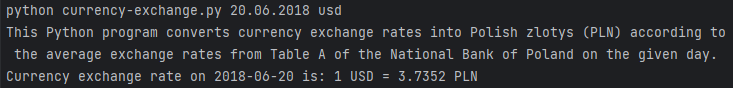

# Currency Exchange
> This Python program **converts currency exchange rates** into Polish zlotys (PLN) according 
> to the average exchange rates from Table A of the [National Bank of Poland](http://www.nbp.pl/) 
> on a selected day (beginning from 2002-01-02).

## Table of Contents
* [General Info](#general-information)
* [Technologies Used](#technologies-used)
* [Features](#features)
* [Screenshots](#screenshots)
* [Setup](#setup)
* [Usage](#usage)
* [Acknowledgements](#acknowledgements)

## General Information
This program was created during my study of Python programming as part of 
[the Practical Python](https://praktycznypython.pl/) educational program of 
[Krzysztof Mędrela](https://medrela.com/).

The purpose of the program was to use an external API to convert exchange rates 
based on the data provided by the user.

Thanks to this task, I learned how to use APIs and apply them to my programming projects.

## Technologies Used
- [Python](https://www.python.org/) - version 3.9.13
- Python packages:
  - _request_ - version 2.29.0
  - _python-dateutil_ - version 2.8.2
- [NBP Web API](https://api.nbp.pl/en.html)

## Features
- The user can provide up to 2 arguments (date and three-letter currency code) 
when running the program.
- The program can also be run with one argument (it doesn't matter if user entered 
the date or the currency codee) or none.
- If the user does not enter any data when starting the program, 
the program will ask for it itself.
- Date can be entered in any way, for example: 
_13.12.2011_, _'15 May 2015'_ or _2016-06-16_, or even _20091209_.

## Screenshots

## Setup
I assume you know how to cloning this repository. If not, I refer you to 
[this publication](https://docs.github.com/en/repositories/creating-and-managing-repositories/cloning-a-repository)

At the beginning You need to make sure you have Python version 3.9, 
as one of the packages does not work with the latest versions of Python.

Type in terminal:\
`python --version`

If You are seeing this answer (* - any digits):\
`Python 3.9.*`

We are at home! Now You need to install _virtual environment_ like this:\
`python -m venv venv`

Next type `cd venv\Scripts` and then `activate`.

Finally type:\
`pip install -r requirements.txt`

After installing the requirements, you can run the program like bellow.

## Usage
How does one go about using it? It's simple. In terminal type:\
`python currency-exchange.py`\
to run program without any arguments

or

`python currency-exchange.py gbp`\
to run program with GBP currency code as one of arguments

or

`python currency-exchange.py 20.11.2019 usd`\
to run program with two arguments (date and currency code)

## Acknowledgements
- This program was inspired by one of exercises of
[the Practical Python](https://praktycznypython.pl/) educational program
- Many thanks to [Krzysztof Mędrela](https://medrela.com/)
